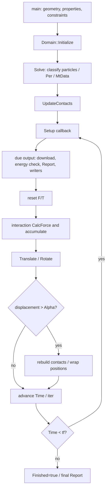

# DEM execution, state and force architecture

Draft for main 1eb8dccb6b6f8da628052c8e562157041841c345, 2026-09-10.
Canonical root: /home/gezhuan/mechsys. See [master map](mechsys_architecture.md).

## Representative executable and call sequence

Use [tdem/test_01.cpp:32](../tdem/test_01.cpp#L32) as a compact friction/contact reference: construct DEM::Domain; AddCube and AddPlane; fix the plane; set block velocity; Initialize(dt); set Ff=m*g; assign tagged stiffness/damping and FricCoeff; Solve; compare stopping distance. The executable prints theoretical/observed distance but returns zero without a tolerance assertion. “Minimal” refers to conceptual simplicity, not cheapest runtime.

Use [tdem/test_dynamics.cpp:22](../tdem/test_dynamics.cpp#L22) for a second independent path: cube and tetrahedron, periodic x, zero friction/damping, momentum/energy before and after Solve, and a return-code tolerance at line 102. It exercises geometry and rotation rather than proving every contact model.

## Stage-by-stage ownership

| Stage and caller | Exact implementation | State affected |
|---|---|---|
| main constructs domain | [lib/dem/domain.h:301](../lib/dem/domain.h#L301), DEM::Domain constructor | Initialized=false, Time=0, Alpha/Beta, ContactLaw; CUDA function pointers |
| main creates geometry | [lib/dem/dompargen.h:561](../lib/dem/dompargen.h#L561) AddSphere; :596 AddCube; :967 AddPlane; :304 GenFromMesh | Particles, vertices/edges/faces, Props, inertia and orientation |
| main loads snapshot | [lib/dem/domain.h:1842](../lib/dem/domain.h#L1842) Domain::Load | Appends reconstructed particles and periodic limits; not an exact restart |
| main assigns tagged material | [lib/dem/domain.h:347](../lib/dem/domain.h#L347) Domain::SetProps | Matching ParticleProps and existing interaction coefficients; FricCoeff is a separate tag-pair map |
| Solve or main initializes | [lib/dem/domain.h:422](../lib/dem/domain.h#L422) Domain::Initialize -> [lib/dem/particle.h:644](../lib/dem/particle.h#L644) Initialize / :654 InitializeVelocity | Properties if needed; xb=x-v*dt, wb=w, energies; constrained xb adjusted on subsequent initialization |
| Solve classifies | [lib/dem/domain.h:496](../lib/dem/domain.h#L496) | FreePar/NoFreePar, mass/volume totals, size bounds, Index=array position |
| Solve builds broad phase | [lib/dem/domain.h:2421](../lib/dem/domain.h#L2421) UpdateContacts -> :2186 ResetDisplacements -> :2228 UpdateLinkedCells | LinkedCell, ListPosPairs, reference vertices, wrapped coordinates |
| broad phase creates/selects contacts | [lib/dem/domain.h:2332](../lib/dem/domain.h#L2332) ResetContacts | PairtoCInt maps pair hashes to persistent CInteractons; active Interactons combines collision and valid bond objects |
| timestep setup | [lib/dem/domain.h:609](../lib/dem/domain.h#L609) ptSetup | User-controlled mutable state; normally update Ff/Tf or launch device kernels rather than F overwritten by reset |
| output | [lib/dem/domain.h:610](../lib/dem/domain.h#L610) | Report invocation and writers before new force calculation; CUDA host refresh is conditional |
| CPU reset | [lib/dem/domain.h:711](../lib/dem/domain.h#L711) | Particle F=Ff, T=Tf |
| CPU contact calculation | [lib/dem/domain.h:722](../lib/dem/domain.h#L722) -> [lib/dem/interacton.h:259](../lib/dem/interacton.h#L259) / :593 / :937 | Contact histories, F1/F2/T1/T2; locked additions into particle F/T |
| optional sphere fast path | [lib/dem/domain.h:2448](../lib/dem/domain.h#L2448) CalcForceSphere | Separate FricSpheres/RollSpheres maps; not interchangeable with normal path |
| integration | [lib/dem/particle.h:735](../lib/dem/particle.h#L735) Translate; :663 Rotate | Position, previous position, velocities, orientation, vertices, geometry and energies |
| neighbor refresh | [lib/dem/domain.h:784](../lib/dem/domain.h#L784) | Rebuild when max vertex displacement exceeds Alpha |
| normal termination | [lib/dem/domain.h:789](../lib/dem/domain.h#L789) then :794 | Time/iter advance, Finished=true, final callback; CUDA final download occurs after callback |
| early/error termination | [lib/dem/domain.h:624](../lib/dem/domain.h#L624) and :730 | Energy threshold at regular output; excessive CPU overlap writes error snapshot and throws |

Default CUDA stepping replaces the CPU reset/force/integration region; see [CPU/CUDA parity](cpu_cuda_parity.md). No DEM substeps are hidden inside current LBMDEM::Solve: its dt is used for both components.

## Particle state and frames

Particle is declared at [lib/dem/particle.h:68](../lib/dem/particle.h#L68); core fields at :115. Props live in ParticleProps at :47.

| Quantity | Representation | Convention |
|---|---|---|
| Position | x, xb | World center and previous Verlet position |
| Velocity | v | World translational velocity |
| Rotation | w, wb, wa, Q | Body/principal-axis angular state; Q rotates body vectors to world |
| Loads | F, Ff, Flbm, Flbmf | World total, prescribed total-load baseline, hydrodynamic accumulator and device hydro baseline |
| Torque | T, Tf | Body-frame total and prescribed baseline; no separate retained hydro torque |
| Inertia/mass | I, Props.m/rho/V/R | Principal inertia, mass, density, volume, spheroradius |
| Geometry | Verts, Vertso, Edges/Faces/Tori/Cylinders | World geometry and displacement-reference vertices |
| Identity | Tag, Index, Cluster | Tag is user grouping and can repeat; Index is array position and can change; not a permanent trajectory UUID |
| Constraints | vxf/vyf/vzf, wxf/wyf/wzf, FixFree | Components of acceleration/torque suppressed; prescribed velocity can still move the particle |
| Shape/boundary | Bdry, Closed, Eroded, Dmax | Not a periodic image number |

Particle::IsFree at :110 requires no constraints OR FixFree. A partially constrained particle otherwise counts as not-free; this affects broad phase and periodic handling, not just motion.

Translate uses position Verlet: xa=2*x-xb+Ft*dt^2/m, v=(xa-xb)/(2*dt); then shifts vertices. Ft is a local copy of F with constrained components zeroed and CPU viscous damping subtracted. No persistent translational acceleration field is maintained. Rotate uses body inertia, gyroscopic terms, midpoint quaternion advancement and normalization, then updates geometry. Fixed velocity and fixed position are not synonyms.

## Contacts and histories

Interacton ([lib/dem/interacton.h:40](../lib/dem/interacton.h#L40)) retains P1/P2, I1/I2 and endpoint loads. CInteracton (:64) adds normal/tangential aggregate fields, Branch, feature-pair lists Lee/Lvf/Lfv and torus/cylinder lists, and feature-keyed tangential displacement maps. CInteractonSphere (:116) adds Fdvv, Fdr, beta/eta and sphere law state. BInteracton (:139) represents a face bond with rest length, force/moment stiffnesses, reference angle, validity and bond force position.

The contact force routines are stateful. Do not call CalcForce a second time to “read” forces: it advances tangential/rolling history. CInteracton::_update_disp_calc_force (:334) computes separation/overlap, contact points, relative velocity including rotation, tangential displacement and Coulomb clipping, damping, and body-frame endpoint torques. Sphere CalcForce (:593) selects linear/Hertz expressions and adds rolling resistance. Bond CalcForce (:937) includes face separation, shear and twist moment and can invalidate a broken bond.

Pair objects persist through PairtoCInt while active membership changes; a dedicated lifetime/event log does not exist. Sphere history is not cleared merely by the no-overlap path. General feature maps also persist; absence from the active list is not a serialized contact-death record.

## Force accounting and stress implications

| Contribution | Where introduced | Where retained |
|---|---|---|
| Collision normal/tangential/damping | CInteracton / CInteractonSphere::CalcForce | F1/F2 then Particle::F; elastic normal/tangential summaries separately |
| Rolling / bond twisting | Sphere CalcForce / BInteracton::CalcForce | Endpoint torques, histories; not a universal “rolling torque” diagnostic |
| Gravity and other body/external force | Executable sets Ff, e.g. test_01.cpp:49 | Copied into F every step |
| Boundary contact | Fixed/kinematic Particle participating in same contact system | Same pair force, not an independent boundary-force array |
| Hydrodynamics | Coupled ImprintLattice / CUDA imprint | F plus Flbm; T receives torque |
| Constraints | Particle::Translate/Rotate or CUDA equivalents | Applied to local load copies; reaction is not explicitly solved/stored as a separate quantity |
| CPU translational/rotational damping | Particle::Translate :743 / Rotate :681 | Applied during integration; not included in raw F/T accumulators |
| User kernel / pExtraParams | Setup / replaceable device kernels | Contract is executable-specific |

Fnet/Ftnet are not automatically the full force used by integration: inspected CPU/CUDA contact routines accumulate elastic normal/tangential summaries before damping. Sphere Fn is repurposed to Fdr at [lib/dem/interacton.h:786](../lib/dem/interacton.h#L786). Do not infer semantics from a short variable name or blindly compute stress from visualization fields.

For a future full contact stress, accumulate a chosen branch dyad with the full pair force in the force routine, include each pair once, document sign/order and averaging volume, and treat damping, wall terms, kinetic stress and couple stress explicitly. For multi-feature particles, decide whether pair aggregates or individual contact-point moments are required. No existing global stress tensor is produced by this DEM path.

## Periodic geometry and trajectories

[lib/dem/distance.h:32](../lib/dem/distance.h#L32) and :595 implement BranchVec(V0,V1)=V1-V0-round((V1-V0)/Per)*Per componentwise. Contact Branch uses P1-P2; the hydro arm uses node minus particle center. These are different orientations.

CPU ResetDisplacements wraps free particles at neighbor rebuild; CUDA ResetMaxD does the analogous shift. xb and geometry shift with x. Positions can remain outside the nominal box between rebuilds. There are no persistent image counters/unwrapped positions. A snapshot sequence alone can be ambiguous if crossings are undersampled.

## Important limits

- MostlySpheres is default false and has separate map/concurrency/periodic assumptions; ResetContacts still indexes CInteractons after its sphere-allocation skip. Do not enable it casually.
- Standard CPU rotation honors RotPar; default CUDA launches rotation unconditionally.
- CPU Gv/Gm damping is not implemented in the default CUDA integrators.
- Contact/bond support is not identical on CUDA: upload enumerates VV/EE/VF/FV collision records, not an equivalent bond/torus/cylinder solver.
- Save/Load and output are detailed in [output architecture](mechsys_output_architecture.md); neither output nor a successful Load demonstrates exact restart equivalence.
