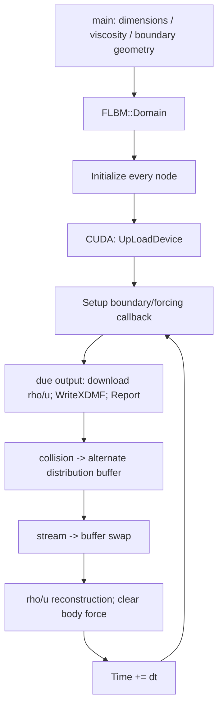

# LBM execution and memory architecture

Draft for 1eb8dccb6b6f8da628052c8e562157041841c345, 2026-09-10.
Canonical root: /home/gezhuan/mechsys. [Master map](mechsys_architecture.md).

## Two implementations: select the correct one

| | Older LBM | FLBM used by current LBMDEM |
|---|---|---|
| Owner | LBM::Domain, [lib/lbm/Domain.h:59](../lib/lbm/Domain.h#L59) | FLBM::Domain, [lib/flbm/Domain.h:81](../lib/flbm/Domain.h#L81) |
| Node abstraction | Global Cell class (:41 in lib/lbm/Cell.h); Lattice owns Cell pointers | No Cell objects; multidimensional host arrays |
| Fluid owner | Domain::Lat array of Lattice | Domain fields for all layers |
| Host distributions | Cell::F/Ftemp/Omeis, neighbors and rho/u per object | F[layer][x][y][z][direction], Ftemp; separate rho/u/body-force arrays |
| Examples | tlbm | tflbm, plus tlbmdem |
| Device stepping | No equivalent active CUDA path traced in lib/lbm/Domain.h | flbm/lbm.cuh and device vectors/pointers |
| Embedded solids | Legacy disks and DEM-like particles in LBM::Domain | Separate LBMDEM::Domain orchestrates DEMDOM and LBMDOM |

Do not migrate an algorithm by replacing one Domain name: storage, timestep nesting, output and callback contracts differ.

## Cell-based reference trace

[tlbm/tlbm01.cpp:76](../tlbm/tlbm01.cpp#L76) constructs D2Q9 LBM::Domain; creates inlet/outlet Cell lists; marks channel walls and an obstacle; initializes every cell; calls Solve. Setup (:36) directly reconstructs unknown boundary distributions and refreshes rho/u.

1. Lattice constructor, [lib/lbm/Lattice.h:85](../lib/lbm/Lattice.h#L85), sets Tau=3*nu*dt/dx^2+0.5 and allocates Cell objects. Cell constructor builds directional neighbors with periodic index wrap.
2. Cell::Initialize, [lib/lbm/Cell.h:236](../lib/lbm/Cell.h#L236), initializes equilibrium distributions and cached rho/u.
3. LBM::Domain::Solve, [lib/lbm/Domain.h:3594](../lib/lbm/Domain.h#L3594), initializes optional solids, chooses dtdem<=dt, creates cell pairs and thread data, then loops in dtdem.
4. Setup and scheduled output occur first. The USE_OMP region resets forces/Gamma, imprints embedded particles when present, computes and integrates solids.
5. When Time>=tlbm, ApplyForce handles interactions between fluid components if enabled; CollideNoPar (:2408) is selected when no particles/disks exist, otherwise CollideSC/MC.
6. Lattice::Stream (:125) pushes moving distributions to neighbors, swaps buffers, reconstructs rho/u. Time advances by dtdem; tlbm advances by dt after a fluid update.
7. Domain sets Finished and invokes final Report (:3989).

The older Solve's active stepping is inside USE_OMP, with empty alternative branches in the inspected loop. OpenMP-disabled compilation is not evidence of a working equivalent serial path.

Cell::VelDen (:198) sums F and velocity and also replaces NaN distributions with 1e-12. It is not a strictly read-only accessor. CollideNoPar also has a positivity/recovery policy. Preserve these distinctions when designing diagnostics.

## FLBM reference trace

CPU [tflbm/tflbm01.cpp:84](../tflbm/tflbm01.cpp#L84) and CUDA [tflbm/tclbm01.cu:95](../tflbm/tclbm01.cu#L95) are useful paired architecture references, though their hard-coded parameters need harmonization before a numerical parity test.

### Initialization and state

[lib/flbm/Domain.h:450](../lib/flbm/Domain.h#L450) constructs the single-fluid domain. D2Q5, D2Q9, D3Q15 and D3Q19 select W/C/Op arrays; Nneigh is the number of discrete velocities. Cs is dx/dt, not the usual acoustic sound speed; the equilibrium uses the corresponding factors of 3. Tau is set at :549. Sc defaults to 0.17, affecting the nonequilibrium-based relaxation correction.

Initialize (:975) fills F with Feq, zeroes BForce and sets rho/u. Constructors zero distribution buffers but do not initialize every macroscopic field for uninitialized nodes. Executables must initialize the domain's nodes deliberately.

The multi-layer constructor is at :260. Solver includes NavierStokes and additional CUDA-dispatched transport/phase/shallow-water modes. Their scientific behavior is lower priority in this audit and not assumed CPU-equivalent.

### Collision, forcing and boundaries

- Standalone CPU Solve (:2183) uses CollideSC (:1324) for one layer; multiphase functions for multiple layers.
- CollideSC shifts equilibrium velocity by dt*tau*BForce/rho, computes nonequilibrium and Sc correction, applies a positivity limiter, handles solid bounce-back, and swaps F/Ftemp.
- Current coupled path uses CollideSCDEM (:1402), replacing the relaxation increment with (1-Bn)*NonEq/tau - Bn*Omeis.
- Solid nodes bounce distributions using Op. Streaming wraps lattice indices periodically; nonperiodic physical boundaries are supplied through solid masks and executable boundary reconstruction.
- CPU tflbm01 Setup (:38) reconstructs inlet/outlet populations. CUDA tclbm01 uses Left_BC (:33), Right_BC (:59), launched by host Setup (:86). Updating host F during a CUDA run does not update device F.
- ApplyForcesSC/SCSS/SCMP/MP are additional fluid-interaction force paths, not hydrodynamic force decompositions for particles.

### Streaming and macro reconstruction

CPU StreamSC ([lib/flbm/Domain.h:1785](../lib/flbm/Domain.h#L1785)) pushes F into Ftemp at wrapped neighbors and swaps. It clears BForce, sets rho/u to zero then reconstructs on fluid nodes from the streamed distribution. No separate persistent node hydrodynamic force-position array is produced.

CUDA flbm/lbm.cuh:836 cudaStream1 pushes distributions; the caller swaps pointers. cudaStream2 (:857) reconstructs rho/u and clears forcing. The coupled solver uses its own lbmdem.cuh:556 cudaStream2, which also clears Omeis for nonsolid cells.

### Host/device memory layout

Host arrays are nested allocations, not one contiguous distribution slab. Device upload flattens them ([lib/flbm/Domain.h:2019](../lib/flbm/Domain.h#L2019)):

- cell index = x + Nx*y + Nx*Ny*z;
- scalar layer index = cell + layer*Ncells;
- distribution index = direction + Nneigh*cell + layer*Ncells*Nneigh;
- direction is contiguous; x is the fastest spatial coordinate.

Persistent device buffers: bF/bFtemp, bIsSolid, bBForce, bVel, bRho, bCellPairs; raw pointers pF/pFtemp/etc launch kernels. Auxiliary lbm_aux contains dimensions, lattice constants, relaxation/forcing parameters and a device clock. Collision and streaming swaps affect raw active pointers; new code must use the active pointers, not assume a particular named buffer always holds current populations.

FLBM::DnLoadDevice (:2151) downloads only bVel and bRho into host arrays. It does not copy F/Ftemp, BForce, masks, Omeis or the auxiliary clock. A normal “full fluid report” therefore still cannot inspect current host populations in a CUDA run.

## Output and restart

FLBM::Solve calls Report only inside the non-null FileKey output block, and gates WriteXDMF on RenderVideo. There is no final Report call in this standalone FLBM Solve. This differs from DEM and LBMDEM.

WriteXDMF (:616) provides grid fields; WriteXDMF_DEM (:784) writes volume-weighted fluid quantities and Gamma. Field files are not population checkpoints. No active FLBM Save/Load API for exact distribution/state restart was found.

## Main correctness / parity cautions

- Single-fluid constructor reads Nl/Solver at :461 before assigning them at :470/:480. This is a concrete initialization defect, pre-existing in the comparison base.
- CPU positivity loops and CUDA bounded limiter loops differ; numerical parity needs testing.
- CPU Solve dispatches primarily on Nl, while CUDA dispatches on Solver; do not assume optional modes have equivalent CPU implementations.
- Stream reset means body-force callbacks must reapply transient fluid forcing each step.
- DnLoadDevice leaves host populations stale. A Report that calls a population-based diagnostic needs an explicit correctly timed copy or a device reduction.
- WriteXDMF_DEM Step downsampling assumes dimensions divisible by Step; see the critical output issue in [development map](mechsys_development_map.md).
