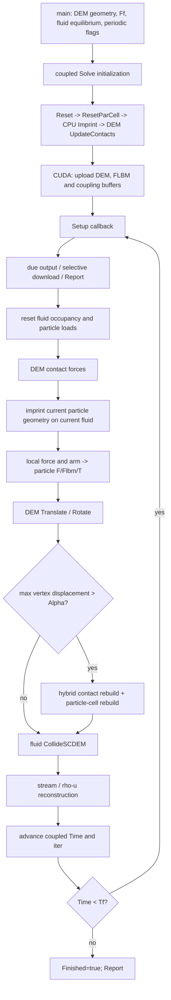

# LBM–DEM coupling and hydrodynamic diagnostics

Draft audited at 1eb8dccb6b6f8da628052c8e562157041841c345, 2026-09-10.
Canonical root: /home/gezhuan/mechsys. [Master map](mechsys_architecture.md).

## Active architecture and examples

[lib/lbmdem/Domain.h:44](../lib/lbmdem/Domain.h#L44) defines LBMDEM::Domain with an FLBM::Domain LBMDOM and DEM::Domain DEMDOM. This is separate from the older embedded-particle implementation in lib/lbm/Domain.h.

Representative CPU execution: [tlbmdem/tlbmdem02.cpp:67](../tlbmdem/tlbmdem02.cpp#L67) creates one moving sphere, assigns Ff=m*acc, initializes a D3Q15 fluid, enables particle periodicity and calls coupled Solve. Its Report compares norm(Flbm) to 6*pi*nu*R*norm(v), with density initialized to one. It is a force-validation starting point, not an asserted convergence test.

CUDA counterpart [tlbmdem/tlbmdem_cu_02.cu:67](../tlbmdem/tlbmdem_cu_02.cu#L67) uses the same Domain but different viscosity/radius and solid y/z walls. They are not identical physical test configurations. CUDA 01 and CPU 01 exercise flow past a fixed sphere; CUDA 03 exercises hydrostatic forcing/buoyancy.

## Complete actual sequence



The order matters: this solver computes imprint forces, advances particles, then collides and streams fluid. Output at the next loop entrance combines advanced geometry with forces from the preceding imprint. There is no instantaneous recomputation of force at the output position. There is no inner DEM subcycling loop in this current coupled solver.

## Stage reference table

| Stage | CPU implementation | CUDA implementation | State / lifetime |
|---|---|---|---|
| Construct / optional DEM load | Domain.h:149 or :200 | Same host constructors | Owns LBMDOM, DEMDOM and coupling arrays |
| Initialize step/contact state | Domain.h:569 Solve; :580 DEMDOM.Initialize(dt) | Same startup | Sets dt, processor counts, free/fixed lists and particle indices |
| Set periodic extents | Domain.h:627 and :677 | Uploaded into demaux | PeriodicX/Y/Z choose DEM extents; fluid streaming itself wraps |
| Candidate mapping | Domain.h:413 ResetParCell | Same host function; :917 UpLoadDevice marshals | ParCellPairs; thread-local LPC; GPU PaCeV / PaCe / PaCeF |
| Reset | Domain.h:518 Reset | lbmdem.cuh:127 cudaReset plus DEM pReset | Gamma/Omeis; particle F/Flbm/T |
| Geometry / occupancy | Domain.h:299 ImprintLattice | lbmdem.cuh:395 active cudaImprintLatticeVC; :461 FC | Local node position C, selected features, len and gamma |
| Boundary velocity | Domain.h:377 | lbmdem.cuh:414 / :480 | B=minimum-image(node-center); world omega from Q*w |
| Solid collision increment | Domain.h:387 | lbmdem.cuh:435 / :531 | Omeis per cell/direction; no retained node force record |
| Hydro accumulation | Domain.h:395–407 | lbmdem.cuh:441–457 / :537–553 | Local Flbm and Tlbm; added to particle total and hydro force, total torque |
| DEM motion | Domain.h:874 | Domain.h:788 | x/xb/v/w/Q and vertices |
| Rebuild | Domain.h:891 | Domain.h:799; DEM UpdateContactsDevice | CPU geometry refresh and new GPU candidate records |
| Fluid collision/stream | Domain.h:897 | Domain.h:817 | F/Ftemp, rho/u; occupancy couples through Bn and Omeis |
| Report / termination | Domain.h:710 / :905 | Same host callbacks; conditional downloads | UserData state, histories; no automatic final download |

## Mapping geometry to occupancy

ResetParCell expands each non-Bdry particle bounding box by 2*Alpha+dx, handles eligible periodic indices, rejects solid lattice nodes, and creates ICell/IPar/IGeo records. IGeo identifies nearby face/edge/vertex features. The pair list is reused until the Verlet threshold triggers rebuilding.

CPU ImprintLattice obtains node C=dx*ICell, suppresses periodic arms for particles not classified free, rejects nodes beyond Dmax, finds the closest applicable feature, and computes a geometric len using SphereCube where necessary. gamma=len/(12*dx) enters Gamma. Candidate acceptance compares against current node Gamma; it is not a normalized per-particle partition of a multiply covered cell.

CUDA upload divides pairs into spheres (one vertex: flat [cell,particle] pairs in PaCeV) and nonspheres (ParCellPairCU with Ic, Ip, Nfi/Nff plus PaCeF). The active sphere kernel takes a function pointer fBn. The old differently signed sphere kernel/refill functions inside the large block comment are not active call paths.

CUDA sphere geometry considers an expanded Dmax+1.74*dx cutoff and sphere/cube intersection with Dmax. CPU starts with a Dmax cutoff and uses its generic feature logic. Face CUDA uses a Dmax cutoff and face distance/normals. These are material parity differences, not merely storage differences.

## Exact force / torque expressions

At CPU Domain.h:377 and active sphere kernel lbmdem.cuh:414:

```text
B = minimum_image(C - particle.x)   # world arm; Per suppressed for nonfree particle
omega_world = rotate(particle.w, particle.Q)
VelP = particle.v + omega_world × B
Omega_k = f_opp - feq_opp(rho, VelP) - [f_k - feq_k(rho, VelP)]
Bn = gamma*(tau-0.5) / [(1-gamma)+(tau-0.5)]  # default smooth rule
F_node = -sum_k Bn*Omega_k*Cs^2*dx^2*C_k
T_node_world = B × F_node
T_node_body = rotate(T_node_world, conjugate(Q))
```

The active CUDA sphere path multiplies F_node by Fconv (lbmdem.cuh:441). CPU imprint and CUDA face imprint do not. CUDA sphere collision and imprint share pfBn; CPU and face imprint hard-code the smooth expression. Changing pfBn to a different rule therefore does not establish full-shape parity.

These F_node values are forces on the particle under the code's sign convention. F is total particle force; Flbm is its hydro accumulator. Tlbm is a temporary variable, not a persistent particle member. Torque is accumulated into total T in body coordinates. A future moment must use world B and world F_node before quaternion conversion.

Imprint's force reduction precedes the fluid positivity limiter. If the limiter scales collision increments, equality between the unscaled force reduction and actual fluid momentum change needs validation; do not assume exact discrete conservation in that regime.

## Memory ownership and synchronization

| Quantity | Host | Device | Persistence |
|---|---|---|---|
| x/v/w/Q, total F, Flbm | DEM Particle; refreshed by DnloadParticle | DynParticleCU | Per particle |
| Total T, prescribed loads, constraints, Tag/Index | DEM Particle; some fields may be stale after device updates | ParticleCU | Per particle; T omitted from normal download |
| Fluid rho/u | FLBM arrays; refreshed by FLBM download | pRho/pVel | Per lattice node |
| Distributions | Host F remains stale during CUDA stepping | pF/pFtemp current | Per node/direction |
| Gamma | LBMDOM.Gamma refreshed by coupled download | pGamma | Per node |
| Gammaf | Initialized host field | pGammaf | Prescribed occupancy; reset asymmetry with CPU |
| Omeis | CPU current during imprint; CUDA host copy stale | pOmeis, cleared in coupled stream | Per node/direction temporary coupling state |
| C/B/VelP/F_node/T_node | CPU local variables | Kernel-local values | Exist only while processing a pair |
| Candidate IDs/features | ParCellPairs | PaCeV/PaCe/PaCeF | Rebuilt on movement threshold |
| First moment / stresslet | None | None | Missing |

DEMDOM.DnLoadDevice copies all dynamic particle records and vertices even when force=false. force=true adds contact/history downloads; it still does not copy ParticleCU::T. FLBM.DnLoadDevice downloads rho/u only. LBMDEM.DnLoadDevice downloads Gamma only. These routines do not provide a complete host snapshot.

## Hydrodynamic diagnostic capability

| Level | Baseline availability | Smallest justified extension |
|---|---|---|
| 0: particle total hydro force | Available: Particle::Flbm / DynParticleCU::Flbm; PHForce visualization and example Report | Export with phase, units and IDs; account for CUDA Flbmf baseline |
| 1: hydro torque | Partial: computed locally and included in total T; no separated retained hydro torque; host CUDA T stale | Add dedicated world torque accumulator and compact download |
| 2: node force-position pairs | Partial: B, C and F_node coexist only in imprint | Optional debug capture keyed by particle/cell; expensive O(pairs) output |
| 3: first hydro moment | Missing, locally implementable as a diagnostic | Sum B outer F_node during imprint; retain nine components per particle |
| 4: symmetric / antisymmetric parts | Missing but algebraic once M exists | Postprocess aggregates; no force-law change |
| 5: stresslet | Missing; discrete symmetric-deviatoric candidate easy after M | Validate sign/origin/volume/traction convention before claiming continuum stresslet |
| 6: resolved surface traction | Missing | Requires a defined surface quadrature/area/normal and force-to-traction reconstruction; voxel overlap alone is not a resolved traction field |

No named stresslet/lubrication implementation was found in the audited active primary path. FLBM includes separate thermal/phase functionality, but that is not DEM frictional heating.

## Exact insertion points for future moments

For CPU, insert the diagnostic reduction after the direction loop finishes at [lib/lbmdem/Domain.h:396](../lib/lbmdem/Domain.h#L396), before body torque conversion/locked accumulation at :397–407. For CUDA sphere, use lbmdem.cuh:443 before atomics; for CUDA face, use :539 before atomics. Include both shapes. Reset aggregates in the corresponding reset phase; copy only after those kernels have completed.

Proposed convention, not existing implementation:

```text
M_ab = sum_nodes B_a * F_node_b
Sym = (M + transpose(M))/2
Anti = (M - transpose(M))/2
S_discrete = Sym - trace(M)*I/3
T_world = (M_yz-M_zy, M_zx-M_xz, M_xy-M_yx)
```

This torque identity is a direct algebraic check on component ordering. If the reference origin shifts by a, M changes by -a outer F_total. Record the particle-center origin and use minimum-image B; do not reconstruct B from already wrapped snapshots.

Recommended ownership: an optional compact diagnostic array owned by LBMDEM::Domain, indexed by DEM particle Index, with explicit reset/download. This avoids expanding all DEM serialization/particle ABIs before the diagnostic design is validated. Atomics are a minimal initial CUDA reduction but not deterministic in summation order. A deterministic reduction is a later requirement if measurements demand it.
