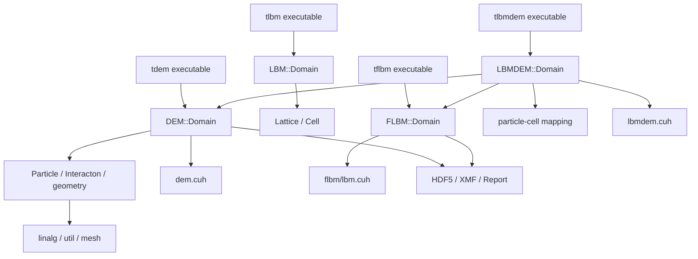

# MechSys architecture and master developer map

Draft audited 2026-09-10. Canonical solver tree: /home/gezhuan/mechsys.
Source revision: 1eb8dccb6b6f8da628052c8e562157041841c345 (main; runnable-baseline-2026-09).
Comparison base: 727a821c1db42fe870ed2e5dd64a7011648bceb7 (local upstream/main).

This is a source-grounded architecture audit, not a numerical validation certificate. No solver was built or run. Findings marked “risk” describe reachable source patterns; their frequency and numerical impact were not measured. Line references refer to the audited revision. On later revisions, locate the named function before relying on the line number.

## Read first: master summary for future developers

1. **DEM**: executable setup creates particles and assigns tagged properties; DEM::Domain::Solve initializes Verlet/leapfrog state, builds linked-cell candidate pairs and persistent contact objects, resets loads, computes contact forces and body-frame torques, advances translation/rotation, and rebuilds neighbors when vertex displacement exceeds Alpha. See [DEM execution](dem_execution_flow.md).
2. **LBM**: there are two distinct families. LBM::Domain owns Lattice/Cell objects in lib/lbm. FLBM::Domain owns field arrays and CUDA buffers in lib/flbm. Both use distributions, collision, streaming and macroscopic reconstruction; current LBMDEM uses FLBM, not the older Cell API. See [LBM execution](lbm_execution_flow.md).
3. **Coupling**: LBMDEM::Domain owns DEMDOM and LBMDOM. Candidate particle/cell pairs give geometric overlap Gamma. Imprint computes surface-point velocity using a periodic arm, solid collision increments Omeis, node force and torque. Particle integration follows; fluid collision/streaming then completes the coupled step. The next step's geometry is not used retroactively for the preceding force. See [coupling](lbmdem_execution_flow.md).
4. **CUDA**: most stepping is device-resident, but neighbor rebuilding is hybrid CPU/GPU. Particle loads use atomics. A download is selective, not a complete mirror: total torque is not downloaded; fluid download contains rho/u only; coupled download contains Gamma only. See [parity](cpu_cuda_parity.md).
5. **Output**: scheduled field writers produce HDF5 plus XMF; Report owns research histories; DEM Save/Load stores particle snapshots but not a full exact restart. Current coupled WriteXDMF is an empty stub; Solve calls component writers directly. See [output](mechsys_output_architecture.md).
6. **Recovered modification**: the baseline adds optional high-frequency Report windows, validation, scheduling tolerance and selective downloads. It retains regular field output. It creates no new trajectory schema, IDs, files, or periodic counters. No force/integration equations changed, but callback frequency can change state when Report has side effects. See [baseline audit](research_baseline_2026-09.md).
7. **Available hydrodynamics**: particle total Flbm is retained; local hydrodynamic torque is added to total torque; each accepted node contribution and its arm exist transiently in imprint.
8. **Missing diagnostics**: separate persistent hydrodynamic torque, node-pair records, first moment, decompositions and stresslet are not implemented in the active coupling path. Computing a discrete moment is a local extension; calling it a resolved surface stresslet requires a defined convention and validation.
9. **Development location**: retain LBMDEM::Domain ownership of coupling diagnostics, compute contributions inside CPU ImprintLattice and both active CUDA imprint kernels, copy compact particle aggregates, and write through Report. Do not recompute coupling in a callback.
10. **Principal risks**: shared-node races; stale host torque/fluid/contact data; CPU/CUDA shape and scaling differences; omitted CPU coupled contact-law argument; incomplete restart; periodic trajectories without image counters; sample positions and force evaluation times differ; constructor/read-before-initialization and output downsampling hazards. Detailed evidence and proposed tests are in the parity/development documents.

## Repository map

| Directory/file | Architectural role and important types | Examples / execution |
|---|---|---|
| lib/ | Header-defined solver implementations, geometry, containers, I/O and CUDA kernels; not a single compiled solver library | Executables include headers and instantiate domains |
| mechsys -> lib/ | Include-name bridge: <mechsys/dem/domain.h> resolves to lib/dem/domain.h | Preserve the Linux symlink |
| lib/dem/domain.h | DEM::Domain, MtData; particle/contact ownership, Solve, neighbor rebuild, device bridge and output | tdem; embedded in LBMDEM |
| lib/dem/particle.h | ParticleProps, Particle, ParticleCU, DynParticleCU; geometry, kinematics, integrators | Creation implemented in dompargen.h |
| lib/dem/interacton.h | Interacton, CInteracton, CInteractonSphere, BInteracton; contact/history and loads | dem.cuh supplies CUDA VV/EE/VF/FV kernels |
| lib/dem/distance.h, basic_functions.h | Minimum-image vectors, feature distances, overlap and sphere/cube geometry support | Contact and coupling use these |
| lib/lbm/ | Older LBM::Domain plus globally declared Lattice/Cell; embedded legacy disk/particle coupling in Dem.h, Interacton.h, Dompargen.h | tlbm; do not confuse with current LBMDEM |
| lib/flbm/Domain.h | FLBM::Domain; array-based fluid solver, output, host/device marshaling | tflbm; also LBMDOM in current LBMDEM |
| lib/flbm/lbm.cuh | lbm_aux, equilibrium functions, collision/stream/forcing kernels | CUDA fluid and coupled executables |
| lib/flbm/lbm.cl | OpenCL source artifact | Not the active CUDA path traced here |
| lib/lbmdem/Domain.h | LBMDEM::Domain, ParticleCellPair, coupled orchestrator | tlbmdem CPU and CUDA examples |
| lib/lbmdem/lbmdem.cuh | lbmdem_aux, ParCellPairCU, active sphere/face imprint and coupled stream kernels | CUDA coupling |
| src/ | Older packing/viewing/result utilities: dem_genpack, dem_viewpack, dem_joinres, dem_viewres | Not the numerical timestep implementation; root ALLDIRS does not add src |
| tdem/ | DEM executable cases, inputs, geometry and plotting scripts | Contact/friction, dynamics, periodicity, CUDA, save/read cases |
| tlbm/ | Older Cell-based fluid and embedded-coupling examples | tlbm01 channel/obstacle; magnus legacy disks |
| tflbm/ | Current array-fluid CPU/CUDA examples | tflbm01 / tclbm01 channel and boundary kernels |
| tlbmdem/ | Current FLBM–DEM examples | CPU 01/02; CUDA 01/02/03 force-oriented cases |
| Modules/ | Dependency discovery, compiler options and include/link flags | Root includes FindDEPS.cmake |
| lib/linalg, lib/util, lib/mesh | Vec3_t/matrices/quaternions, Array/Dict/Fatal/timing, mesh creation | Shared by the primary solvers |
| lib/vtk, lib/python, scripts/, patches/ | Visualization, legacy postprocessing, dependency/build helpers | Support infrastructure, not new coupling physics |
| lib/lbmmpm; tlbmmpm | Adjacent LBM/MPM coupling | Different solid model; do not reuse its moments as DEM stress |
| adlbm, emlbm, emlbm2, sph, mpm, dfn, nn and their t* directories | Additional methods | Summarized only; not exhaustively audited |
| libstable/ | Ignored upstream library snapshot | Not an active include target; preserve as historical material |

## Dependency map

## Build and compilation contract

Root [CMakeLists.txt:19](../CMakeLists.txt#L19) enables testing but the inspected tdem/tlbm/tflbm/tlbmdem CMake files primarily create executables; they are not a comprehensive automatically asserted regression suite. Root options A_WITH_TDEM, A_WITH_TLBM, A_WITH_TFLBM and A_WITH_TLBMDEM select example directories ([CMakeLists.txt:24](../CMakeLists.txt#L24)). Root ALLDIRS dispatch is at [CMakeLists.txt:70](../CMakeLists.txt#L70).

[Modules/FindDEPS.cmake:22](../Modules/FindDEPS.cmake#L22) defines optimization, diagnostics, precision and dependency options. CUDA and Fortran are enabled at lines 51 and 128 even if only CPU examples are intended. Thus “turn off CUDA examples” is not equivalent to “no CUDA compiler needed” for this build configuration.

| Option/macro | Role / caution |
|---|---|
| A_USE_OMP -> USE_OMP | OpenMP loops/locks; default on. Several primary functions assume OpenMP support; legacy Solve encloses its actual stepping in USE_OMP |
| A_USE_HDF5 -> USE_HDF5 | Default on; HDF5 headers/linking and particle writers. DEM/coupled Solve calls writers without equivalent surrounding guards, so off is not proven buildable |
| A_USE_VTK -> USE_VTK | Default off; legacy interactive utilities |
| A_MAKE_STDVECTOR -> USE_STDVECTOR | Array storage choice; default on |
| A_MAKE_CHECK_OVERLAP -> USE_CHECK_OVERLAP | Default on; CPU excessive-overlap diagnostics/error exit |
| A_MAKE_USE_GPU_DOUBLE -> USE_GPU_DOUBLE | Default on; device real precision; record compiler/hardware for reproducibility |
| A_MAKE_IGNORE_SOLID -> IGNORESOLID | Optional FLBM valid-node path; not presumed compatible with every solver |
| USE_CUDA | Added per .cu example target; different orchestration and data ownership |
| ContactLaw constructor argument | 0 linear, 1 Hertz sphere kernel selection; do not rely on old USE_HERTZ option comments |
| USE_IBB / USE_LADD | Commented-out CMake options and inactive/commented source alternatives are not active baseline implementations |
| -O3 / CUDA_ARCHITECTURES native | Existing defaults; hardware-specific builds, not portable binary guarantees |

Header definitions, public mutable fields, default constructors and shallow assignments favor single-executable research programs. RAII ownership is incomplete: DEM destructor cleanup is commented out ([lib/dem/domain.h:334](../lib/dem/domain.h#L334)), and coupled Solve allocates thread arrays on each call. Treat repeated construction/Solve in a long-running service as a separate engineering task.

## Audit boundaries and use

Read the relevant flow document before editing. For every new diagnostic define frame, sign, sample phase, units, ownership and host freshness. Keep baseline-preserving diagnostics separate from corrections that alter forces. Do not use the Windows copy or libstable to replace canonical solver files.

These drafts cover all requested primary execution paths and concrete risks. They do not prove every optional solver mode, historical utility or arbitrary callback correct; additional runtime validation should target the named risks rather than repeat the whole architecture audit.
