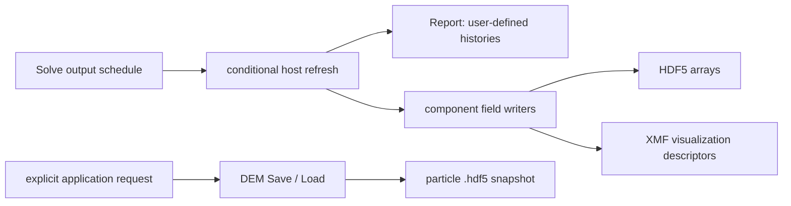

# Output, restart and high-frequency reporting

Draft at 1eb8dccb6b6f8da628052c8e562157041841c345, 2026-09-10.
Canonical root: /home/gezhuan/mechsys. See [baseline audit](research_baseline_2026-09.md) and [CUDA freshness](cpu_cuda_parity.md).

## Output dispatch by solver

| Solver | Scheduling / callback order | Built-in field dispatch |
|---|---|---|
| DEM::Domain | Solve at [lib/dem/domain.h:481](../lib/dem/domain.h#L481); Setup -> due download -> energy stop check -> Report -> writers -> forces/integration | WriteXDMF and WriteBF; FileKey-based; Render argument does not gate these calls |
| LBMDEM::Domain | Solve at [lib/lbmdem/Domain.h:569](../lib/lbmdem/Domain.h#L569); Setup -> due downloads -> Report -> writers -> coupled step | DEMDOM.WriteXDMF, DEMDOM.WriteBF, LBMDOM.WriteXDMF_DEM; RenderVideo does not gate these calls |
| FLBM::Domain | Solve at [lib/flbm/Domain.h:2183](../lib/flbm/Domain.h#L2183); Setup -> due rho/u download -> writer -> Report | RenderVideo gates writer; non-null FileKey gates Report; no final callback |
| Older LBM::Domain | Solve at [lib/lbm/Domain.h:3594](../lib/lbm/Domain.h#L3594); Setup -> regular writer -> Report | RenderVideo gates writer; PrtDou chooses WriteXDMF_D; final Finished callback |
| Lattice | [lib/lbm/Lattice.h:555](../lib/lbm/Lattice.h#L555), separate lower-level Solve API | WriteXDMF / WriteVTK functions exist; not the tlbm01 Domain path |

Important source names: DEM WriteBF means branch/contact force output, not a plain text “body-force log.” Current LBMDEM::WriteXDMF at [lib/lbmdem/Domain.h:547](../lib/lbmdem/Domain.h#L547) has an empty body. It is not the implementation to extend for automatic coupled fields unless dispatch is deliberately redesigned.



Visualization and analysis share field writers, while Report is the research hook. Snapshot Save is a separate API, but this is not a fully separated output/checkpoint subsystem with schemas and exact restart contracts.

## Writer inventory and data meaning

### DEM geometry and particles

[lib/dem/domain.h:1075](../lib/dem/domain.h#L1075) WriteXDMF writes a .h5 plus .xmf. Geometry includes vertex coordinates, face connectivity, Tag/Cluster and velocities. Particle arrays include:

- Position, Radius, Rod, Inertia;
- PVelocity, PAngVelocity, PAngacceleration, PAngMomentum;
- PUForce (actual Particle::F total force, despite its name);
- PHForce (Particle::Flbm);
- PEkin (Ekin+Erot), PTag.

Most DEM visualization arrays are converted to float. Angular velocity/acceleration output is rotated to world coordinates; particle w/wa are body-frame state. There is no dedicated hydro torque, moment tensor, persistent Index dataset in this particle visualization set, or periodic image counter. Array order and PTag are insufficient as a universal immutable identity scheme.

### Contacts and bonds

[lib/dem/domain.h:823](../lib/dem/domain.h#L823) WriteBF selects collision objects with norm(Fnet)>1e-12 and returns immediately if none. It writes float Normal, Tangential, Rolling, Branch, Position, and integer ID1/ID2; bond arrays BNormal, BTangential, BPosition, BVal, BID1/BID2 follow when present. Because of the early return, a bond-only output request may produce no file.

Branch follows the pair orientation P1-P2 (minimum-image for BothFree), while Position is P2.x. Normal/Tangential represent the implementation's summaries and generally omit viscous damping. CPU and CUDA summary freshness differs. These arrays are useful visualization data, not a complete full-contact stress or restart representation.

WriteFrac ([lib/dem/domain.h:1464](../lib/dem/domain.h#L1464)) exports failed bond faces, separate from scheduled WriteBF. It is not automatically a full fracture state checkpoint.

### Fluid fields

FLBM::WriteXDMF ([lib/flbm/Domain.h:616](../lib/flbm/Domain.h#L616)) produces grid fields. WriteXDMF_DEM (:784) explicitly outputs Density_j, Velocity_j, Gamma and grid dimensions. Density and velocity in this coupled writer are averaged after multiplying by (1-Gamma); they are not raw intrinsic fluid rho/u. Step controls block averaging. No populations or node-force-position records are saved by that writer.

Both routines create/truncate HDF5 files, allocate temporary arrays, flush and close, then write XMF text. File-per-frame output is designed for visualization and can create many files.

Older lib/lbm/Domain.h includes WriteXDMF (:726), WriteXDMF_D (:1288), WriteBF (:301), WriteFrac (:534), and a particle-oriented Load (:1784). The presence of that Load is not a fluid-population checkpoint API. Lattice also has independent WriteXDMF/WriteVTK methods.

### Research RES/history files

The examples own std::ofstream in UserData. In [tlbmdem/tlbmdem02.cpp:47](../tlbmdem/tlbmdem02.cpp#L47) and [tlbmdem/tlbmdem_cu_02.cu:47](../tlbmdem/tlbmdem_cu_02.cu#L47):

1. Report sees idx_out==0, opens FileKey_force.res and writes a header.
2. While !Finished it appends Time, norm(Flbm), norm(v), and analytical drag.
3. When Finished it closes the stream.

Example 01 also traverses all fluid nodes for average flow/drag and reads total T. CUDA total T is not refreshed by the normal download, and high-only ParticlesOnly reports leave the fluid averages stale. Example 03 compares vertical force with buoyancy. Shipped RES schemas do not gain Index/Tag columns from the recovered header patch.

Examples use std::endl, flushing each row. Their file stream is normally opened once per Solve, not once per timestep. A new callback should use its own explicit stream-open flag and sample counter instead of assuming idx_out increments on every Report.

## File naming and growth

| Path | Regular name stem |
|---|---|
| DEM particles | FileKey_#### |
| DEM contacts | FileKey_bf_#### |
| Coupled particles | FileKey_dem_#### |
| Coupled contacts | FileKey_dem_bf_#### |
| Coupled fluid | FileKey_lbm_#### |
| Example force history | FileKey_force.res |
| Explicit DEM snapshot | FileKey.hdf5 |

idx_out resets to zero at Solve entry and advances only for regular field events in the recovered path. High-only events retain the same idx_out. Therefore a custom Report that uses idx_out for per-sample filenames can overwrite earlier samples. The supplied force histories append rows, so they do not have that particular overwrite mechanism.

Normal built-in output is O(number of field frames * particles/cells/contacts). High-frequency particle histories can grow O(number of high samples * particles); node-pair debug dumps would grow O(samples * candidate pairs). A fluid-reducing callback can be costly even when field-file frequency is unchanged.

## Snapshot / restart contract

DEM Save at [lib/dem/domain.h:1656](../lib/dem/domain.h#L1656) writes .hdf5 with NP and periodic bounds, then per-particle geometry, Index/Tag, x/xb/v/w/wb/I/Q, radius/density/mass/volume/diameter/Dmax, connectivity and cylinder count. Load at :1842 appends reconstructed Particle objects and restores those quantities.

It does **not** serialize the complete simulation state: no Domain Time/iter/Initialized, high-frequency schedule, all material/contact parameters, constraints/prescribed forces, tangential/rolling/contact histories, bond state, callbacks/UserData, fluid populations, GPU buffers, or immutable periodic image history. Subsequent Initialize can reinitialize xb/wb from velocities. Consequently this is a particle snapshot/packing reload mechanism, not exact trajectory continuation.

[tdem/test_write.cpp:27](../tdem/test_write.cpp#L27) and test_read.cpp:28 demonstrate saving, loading and visualization, not restart-equivalence testing. A coupled constructor accepting DEMfile initializes a new fluid domain around loaded particles ([lib/lbmdem/Domain.h:200](../lib/lbmdem/Domain.h#L200)); it does not restore the old fluid.

Save/Load create HDF5 groups in loops without matching visible H5Gclose calls for all groups. Treat long-running repeated snapshot use as a resource-lifetime review item.

## High-frequency scheduler reconstruction

DEM setters: [lib/dem/domain.h:464](../lib/dem/domain.h#L464). Coupled setters: [lib/lbmdem/Domain.h:551](../lib/lbmdem/Domain.h#L551).
Loop dispatch: DEM :609–662; coupled :710–756.

The setter stores Enabled, T1, T2 and dtHigh; coupled adds ParticlesOnly (default true). Validation rejects T1<0, T2<T1, dtHigh<=0. Solve rejects dtOut<=0. Setters do not reject NaN/infinity or enforce dtHigh>=simulation dt.

At Solve entry:

```text
tout = Time; toutData = Time; toutHigh = HighOutputT1
timeTol = 1e-10 * max(1, abs(final_time), abs(initial_Time))
fieldOutput = Time + timeTol >= tout
dataOutput = Time + timeTol >= toutData
highOutput = Enabled && Time + timeTol >= toutHigh
                         && toutHigh <= T2 + timeTol
```

There is one Report call for the union of regular/high events. Field/data schedules advance past current Time using do/while. High schedule similarly skips elapsed times and may schedule T2 as an extra endpoint. No interpolation or additional timesteps are introduced. Sampling resolution is bounded by dt. fieldOutput and dataOutput start equal and share dtOut, so regular events coincide in the present implementation.

High output reuses existing Report: no new file routine or data schema; IDs, file names, open/close behavior and unwrapping remain callback responsibilities.

| Event | DEM CUDA | LBMDEM CUDA |
|---|---|---|
| Regular output | Dynamic particles + vertices + contacts/history | Same DEM data plus fluid rho/u and Gamma |
| High-only | Dynamic particles + vertices; contacts/history skipped | DEM download with force=true, including contacts/history |
| High-only with ParticlesOnly=true | Not a DEM parameter | Fluid rho/u and Gamma skipped |
| High-only with ParticlesOnly=false | Not applicable | rho/u and Gamma also downloaded; populations and torque still not included |

No separate high-frequency field files are automatically emitted. The high-frequency path does not call built-in Save. Existing energy stopping remains tied to regular field events, though the newly introduced tolerance/skip-ahead scheduling can alter the exact check timestep.

## Time, state and correctness

Report receives a mutable Domain and UserData. Extra invocations are safe as observation only if the callback is observational. Callback changes to forces/constraints can alter CPU dynamics; CUDA callbacks may launch kernels. Downloads themselves also update host mirrors, geometry, energies and contact-history maps. It is inaccurate to describe every Report as “only reads state.”

Output occurs before the current force calculation. Except initial coupled imprint, the force fields describe the preceding force stage while position/orientation have advanced. This affects moment reconstruction: multiplying an old force by a newly sampled arm is not the imprint moment.

Termination is also asymmetric: DEM invokes final Report before its final CUDA download (domain.h:795); coupled invokes final Report with no final download (:905). The final callback is reliable for closing a stream, not necessarily for a final synchronized sample.

## Source-derived scheduling probes

An in-memory Python transcription of the scheduler was exercised, without running or modifying solver code:

| Inputs | Observed scheduler behavior |
|---|---|
| Time=0, dt=.1, dtOut=.5, high [.2,.4] every .1 | High events at .2/.3/.4, regular at 0/.5; coincident events use one callback |
| Initial Time=.8 with high [.2,.4] | A high event can occur at .8: condition bounds scheduled toutHigh, not current Time |
| dt=.3, high [.1,.2] | A high event occurs at .3, outside the requested window |

Floating-point accumulation can also leave a nominal final time just below Tf, allowing one more loop iteration. These probes support the scheduling interpretation; they are not compiled C++ or numerical solver tests.

Extremely small increments can fail to advance a floating-point schedule; NaN/infinity and mid-Solve setter calls are not robustly handled. Calling the setter during Solve does not reset the local toutHigh variable. Use configured-before-Solve windows and ordinary finite intervals until separately validated.
